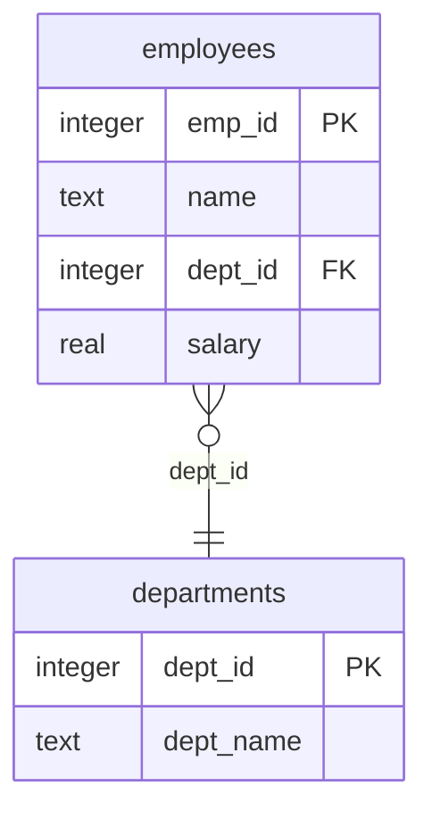

# Advanced Text-to-SQL Agent v3.2.0 (2026-04 Refresh)

Spider 2.0 벤치마크 2026-04 기준 최신 기술 + GPT-5.4 Responses API 네이티브 파라미터 풀 활용 + Pydantic v2 Structured Outputs를 적용한 고성능 Text-to-SQL 솔루션입니다.

## 🆕 v3.2.0 주요 업데이트 (2026-04-17)

### Responses API 네이티브 파라미터 풀 활용 (Microsoft Learn 2026-04 기준)

| 항목 | v3.1.5 | **v3.2.0** | 효과 |
|------|--------|-----------|------|
| **심층 추론 제어** | system prompt에 "심층 추론 모드" 문자열 삽입 | **✅ `reasoning={"effort": "low"/"high", "summary": "auto"}`** 네이티브 | 실제 reasoning token 할당, 단순 질문은 effort=low로 응답속도↑ |
| **응답 길이 제어** | 없음 (max_output_tokens만) | **✅ `text.verbosity="low"`** | GPT-5 계열 응답 압축 → 지연/비용 ↓ |
| **Prompt Caching** | 미사용 (캐시 miss 빈번) | **✅ `prompt_cache_key` (DB 단위 해시)** + `prompt_cache_retention="24h"` | 입력 토큰 비용 최대 **100%(PTU) / 50%(Standard)** 절감, 유지시간 1h→24h |
| **reasoning 모델 temperature** | `temperature=0.1` 항상 전달 (gpt-5 계열 오류 위험) | **✅ reasoning 모델 자동 감지 후 제거** | GPT-5/o-series 호환성 확보 |
| **Self-Correction 피드백** | 오류 메시지만 전달 | **✅ 실행 성공 후 0행 결과 자동 감지 → 조건 완화 재생성** (ReFoRCE 스타일) | "실행은 되는데 빈 결과" 케이스 자동 복구 |
| **토큰 관측성** | 없음 | **✅ `last_token_usage` + API 응답 `token_usage`** (input/output/cached/reasoning) | 캐시 히트율·reasoning 비중 실측 가능 |
| **임베딩 Schema Retriever** | 키워드 + 퍼지 매칭만 | **✅ `EmbeddingSchemaRetriever` (text-embedding-3-small, 코사인 유사도)** | 대규모 스키마(수십~수백 테이블)에서 의미 기반 테이블 선정, 질문 임베딩 FIFO 캐시(200개) + SHA256 스키마 지문 기반 재인덱싱 억제 |
| **Spider 2.0 1위** | TCDataAgent-SQL 95.14% (오래됨) | **✅ Genloop Sentinel Agent v2 Pro 96.70%** (2026-04 공식 리더보드) | 벤치마크 최신화 |

### Spider 2.0-Snow 리더보드 (2026-04, spider2-sql.github.io 기준)

| 순위 | 방법 | 점수 |
|------|------|------|
| 1 | Genloop's Sentinel Agent v2 Pro | **96.70** |
| 2 | Native mini (usenative.ai) | 96.53 |
| 3 | QUVI-3 + Gemini-3-pro-preview (DAQUV) | 94.15 |
| 4 | TCDataAgent-SQL + Contextual Scaling Engine (Tencent) | 93.97 |
| 5 | Prism Swarm with Deepthink + Claude-Sonnet-4.5 (Paytm) | 90.49 |

### v3.2.0 환경변수 (선택적)

```bash
# Responses API 네이티브 파라미터 튜닝 (기본값 그대로 사용 권장)
TEXT2SQL_REASONING_EFFORT=low          # 기본 effort (none/minimal/low/medium/high/xhigh)
TEXT2SQL_DEEP_REASONING_EFFORT=high    # 복잡 질문용 effort
TEXT2SQL_VERBOSITY=low                 # 응답 길이 (low/medium/high)
TEXT2SQL_PROMPT_CACHE_RETENTION=24h    # in-memory(1h) / 24h
TEXT2SQL_ENABLE_EXECUTION_FEEDBACK=1   # Self-Correction 빈 결과 자동 재생성

# 임베딩 기반 Schema Retriever (기본 비활성 — 대규모 스키마에서만 활성화)
TEXT2SQL_ENABLE_EMBEDDING_RETRIEVAL=0  # 1=활성 (API 서버 기동 시 자동 index)
TEXT2SQL_EMBEDDING_DEPLOYMENT=text-embedding-3-small
TEXT2SQL_EMBEDDING_TOP_K=5             # 임베딩 보강 최대 테이블 수
TEXT2SQL_EMBEDDING_MIN_SCORE=0.25      # 코사인 유사도 최소 임계값
```

### 임베딩 Schema Retriever 사용 예시

```python
from text_to_sql_agent import SchemaExtractor
from schema_linker import SchemaLinker
from schema_retriever import EmbeddingSchemaRetriever

schema = SchemaExtractor.extract_sqlite_schema("large_warehouse.db")
linker = SchemaLinker(schema)

retriever = EmbeddingSchemaRetriever(deployment_name="text-embedding-3-small")
linker.attach_retriever(retriever, top_k=5, min_score=0.25)
# → 내부에서 테이블을 "Table: X | Columns: ... | PK/FK" 로 직렬화 후 1회 배치 임베딩
# → 동일 스키마 재접속 시 SHA256 지문으로 재인덱싱 스킵

result = linker.link("작년 4분기 북미 지역 적자 라인업은?")
# 키워드/퍼지 매칭이 top_k 미만일 때만 임베딩 보강 (link_type="embedding")
```

### v3.2.0 코드 사용 예시

```python
from text_to_sql_agent import TextToSQLAgent

agent = TextToSQLAgent(
    deployment_name="gpt-5.4",
    default_reasoning_effort="low",    # 단순 질문: 빠른 응답
    deep_reasoning_effort="high",      # 복잡 질문: 자동 상승
    verbosity="low",                   # SQL만 간결히
    prompt_cache_retention="24h",      # 스키마 캐시 24시간 유지
)
agent.load_database("sample_company.db")  # prompt_cache_key 자동 생성

result = agent.ask("부서별 평균 연봉은?")
print(result["sql"])
print("토큰 사용량:", agent.last_token_usage)
# {'input_tokens': 2341, 'output_tokens': 180, 'cached_tokens': 2048,
#  'reasoning_tokens': 320, 'total_tokens': 2521}
```

---

## 🆕 v3.1.5 주요 업데이트 (2026-03-31)

| 항목 | v3.1.4 | **v3.1.5** | 효과 |
|------|--------|-----------|------|
| **런타임 설정** | 개별 파일에서 env 직접 조회 | **✅ `runtime_config.py` 중앙화** | 배포명/API 버전/TTL/CORS 일관성 확보 |
| **요청 추적** | 별도 식별자 없음 | **✅ `request_id` / `duration_ms` 추가** | 운영 분석 및 장애 추적 용이 |
| **감사 로그** | 없음 | **✅ in-memory query audit log** | 최근 요청 이력 확인 가능 |
| **운영 메트릭** | health 중심 | **✅ `/telemetry/summary`, `/telemetry/queries`** | 관측성 향상 |

## 🆕 v3.1.4 주요 업데이트 (2026-03-17)

| 항목 | v3.1.3 | **v3.1.4** | 효과 |
|------|--------|-----------|------|
| **멀티턴 API 세션** | `session_id` 미사용 | **✅ ConversationalSQLAgent 연결** | 후속 질문 문맥 유지 |
| **추가 지시사항** | 요청 필드만 존재 | **✅ SQL 생성 프롬프트 반영** | 비즈니스 규칙/필터 반영 |
| **결과 행 제한** | 고정 100행 | **✅ `max_rows` 제어** | API 페이로드/응답량 제어 |
| **헬스 체크** | 단순 상태만 반환 | **✅ 운영 메타데이터 포함** | 세션/에이전트 상태 확인 용이 |

## 🆕 v3.1.0 주요 업데이트 (2026-03-14)

| 항목 | v3.0.0 | **v3.1.0** | 효과 |
|------|--------|-----------|------|
| **REST API** | ❌ CLI만 | **✅ FastAPI 서버** | HTTP 기반 프로그래밍 통합 |
| **MCP Server** | ❌ | **✅ Model Context Protocol** | AI 에이전트 표준 연동 |
| **Streaming** | ❌ | **✅ SSE (Server-Sent Events)** | 실시간 추론 과정 표시 |
| **파괴적 SQL 확인** | ❌ | **✅ QueryGuard** | INSERT/UPDATE/DELETE 안전장치 |
| **모호 질문 감지** | ❌ | **✅ AmbiguityDetector** | 후속 질문으로 정확도 향상 |
| **그래프 시각화** | ❌ | **✅ SchemaGraphBuilder** | 테이블 관계 시각화 + Mermaid ER |

### v3.1.1 ~ v3.1.3 버그 수정 및 최적화

| 버전 | 주요 변경 내용 |
|------|---------------|
| **v3.1.1** | dialect_handler 변환 로직 보정, ambiguity_detector 감지 정확도 개선, demo_app 메뉴/배너 수정 |
| **v3.1.2** | schema_linker 퍼지 매칭 임계값 조정, sql_optimizer Self-Correction 패턴 보정, text_to_sql_agent 스키마 캐시 무결성 강화 |
| **v3.1.3** | api_server 방언 변환 SQL 실행 분리 (`sqlite_sql`/`response_sql`), ask_with_history 빈 SQL 실행 방어, MCP dialect 파라미터 실제 적용, 스트리밍 방언 변환 지원 |

| 항목 | v2.2.1 | **v3.0.0** | 효과 |
|------|--------|-----------|------|
| **API 엔진** | `chat.completions.create()` | **`responses.create()`** | Responses API 마이그레이션 |
| **Structured Outputs** | JSON Schema dict | **Pydantic v2 BaseModel** | 타입 안전성 + 자동 검증 |
| **멀티턴** | conversation_history 수동 관리 | **`previous_response_id`** | 서버 사이드 대화 체이닝 |
| **요청 형식** | `messages=[{role, content}]` | **`instructions` + `input`** | 간결한 프롬프트 구성 |
| **응답 추출** | `response.choices[0].message.content` | **`response.output_text`** | 단순화된 응답 접근 |
| **토큰 파라미터** | `max_completion_tokens` / `max_tokens` | **`max_output_tokens`** | 통일된 파라미터 |
| **SQL 방언** | 4종 (SQLite, PG, BQ, Snowflake) | **6종 (+MySQL, SQL Server)** | 엔터프라이즈 DB 지원 |
| **최적화 규칙** | 9개 (중복 2개 포함) | **11개 (중복 제거, 신규 2개)** | Cartesian Join + Window Function |
| **모델** | 17종 | **17종 (GPT-5.4 기본값 추가, GPT-5.2 호환 유지)** | GPT-5.4 기본, GPT-5.2 계열 호환 |
| **Spider 2.0** | TCDataAgent-SQL 95.14% (추정치) | **Genloop Sentinel Agent v2 Pro 96.70%** (공식) | 2026-04 리더보드 실측 반영 |
| **API 버전** | `v1` (가상) | **`2025-04-01-preview`** | 실제 Azure API 버전 |
| **한국어 키워드** | 50+ | **55+** | 사이, 비어있는, 최근, 분기별 등 |

### 핵심 마이그레이션: Chat Completions → Responses API

```python
# ❌ v2.x (이전 방식)
response = client.chat.completions.create(
    model="gpt-5.4",
    messages=[
        {"role": "system", "content": system_prompt},
        {"role": "user", "content": user_prompt},
    ],
    response_format={"type": "json_schema", "json_schema": schema},
    max_completion_tokens=32768,
)
result = response.choices[0].message.content

# ✅ v3.0 (Responses API)
response = client.responses.create(
    model="gpt-5.4",
    instructions=system_prompt,    # system → instructions
    input=user_prompt,             # user message → input
    text={"format": {"type": "json_schema", ...}},  # Structured Outputs
    max_output_tokens=32768,       # 통일된 토큰 파라미터
)
result = response.output_text      # 간결한 응답 접근
```

### 멀티턴 대화 체이닝 (previous_response_id)

```python
# v3.0: 서버 사이드 대화 체이닝
response1 = client.responses.create(model="gpt-5.4", input="첫 번째 질문", ...)
response2 = client.responses.create(
    model="gpt-5.4",
    input="후속 질문",
    previous_response_id=response1.id,  # 자동 컨텍스트 유지
    ...
)
```

### v3.0 코드 최적화 사항

| 대상 | 최적화 내용 |
|------|-------------|
| `text_to_sql_agent.py` | `_build_text_config()` DRY 헬퍼 추출, `__slots__` 추가, `additionalProperties: false` 스키마 보정, `_JSON_PATTERN` 클래스 레벨 프리컴파일 |
| `sql_optimizer.py` | 인라인 `re.search()` 3개 → 프리컴파일 `_PATTERNS` dict 통합, `SelfCorrectionEngine._COMPILED_PATTERNS` 클래스 레벨 1회 컴파일, `__slots__` 추가 |
| `schema_linker.py` | `_table_dict` O(1) 룩업 딕셔너리 추가, `next()` 제너레이터 스캔 제거, `__slots__` 추가, `@dataclass(slots=True)` 적용 |
| `dialect_handler.py` | `get_dialect_hints` if/elif 6단 → `_DIALECT_HINTS` dict dispatch, LIMIT→TOP 프리컴파일 패턴, `@dataclass(slots=True, frozen=True)` |
| `demo_app.py` | 메뉴 분기 if/elif 7단 → dispatch dict O(1), `Callable[[], None]` 타입 힐트 정확화, `_print_query_result()` DRY 헬퍼 |

---

## 🏆 주요 특징

### 1. Responses API + Pydantic v2 Structured Outputs

```python
from pydantic import BaseModel, Field

class SQLGenerationSchema(BaseModel):
    reasoning: str = Field(description="단계별 추론 과정")
    sql: str = Field(description="생성된 SQL")
    confidence: float = Field(description="확신도 0.0~1.0")
    explanation: str = Field(description="SQL 설명")
    assumptions: list[str] = Field(description="가정 사항")
    alternative_queries: list[str] = Field(description="대안 쿼리")
```

### 2. 다단계 추론 (Multi-step Reasoning)

복잡한 질문을 분해하여 단계별로 SQL을 생성합니다.

```
┌─────────────────────────────────────────────────────────────────────────────┐
│  💬 사용자 질문                                                              │
│  "평균 연봉보다 높은 급여를 받는 개발팀 직원의 프로젝트 참여 현황"            │
└─────────────────────────────────────────────────────────────────────────────┘
                                    │
                                    ▼
                    ┌───────────────────────────────┐
                    │     🔍 질문 분해 (Decompose)   │
                    └───────────────────────────────┘
                                    │
            ┌───────────────────────┼───────────────────────┐
            ▼                       ▼                       ▼
    ┌───────────────┐      ┌───────────────┐      ┌───────────────┐
    │ Step 1        │      │ Step 2        │      │ Step 3        │
    │ 전체 평균     │      │ 개발팀 필터   │      │ 프로젝트 조인 │
    │ 연봉 계산     │      │ + 급여 조건   │      │               │
    └───────────────┘      └───────────────┘      └───────────────┘
            │                       │                       │
            └───────────────────────┼───────────────────────┘
                                    ▼
                    ┌───────────────────────────────┐
                    │      🔗 SQL 결합 (Combine)     │
                    └───────────────────────────────┘
                                    │
                                    ▼
┌─────────────────────────────────────────────────────────────────────────────┐
│  📝 최종 SQL (WITH CTE 사용)                                                 │
│  WITH avg_salary AS (SELECT AVG(salary) as avg FROM employees)              │
│  SELECT e.name, p.project_name, pa.role                                     │
│  FROM employees e                                                            │
│  JOIN project_assignments pa ON e.emp_id = pa.emp_id                        │
│  JOIN projects p ON pa.project_id = p.project_id                            │
│  WHERE e.dept_id = 1 AND e.salary > (SELECT avg FROM avg_salary)            │
└─────────────────────────────────────────────────────────────────────────────┘
```

**심층 추론 자동 활성화 키워드:**

| 카테고리 | 감지 키워드 |
|---------|-------------|
| 비교/집계 | 평균보다, 비교, 가장, 최대, 최소, 평균, 합계, 총 |
| 그룹화 | 그룹별, 부서별, 월별, 연도별, 팀별, 분류별 |
| 서브쿼리 | 서브쿼리, 조인, join, 하위쿼리 |
| 순위 | 상위, 하위, top, rank, 순위, n번째 |
| 조건 | 제외, 포함, 사이, 비어있는 (v3.0 신규) |

### 3. 스키마 링킹 (Schema Linking)

자연어와 데이터베이스 스키마를 지능적으로 매핑합니다.

```
┌─────────────────────────────────────────────────────────────────────────────┐
│  💬 자연어 질문: "개발팀 직원들의 평균 연봉을 알려주세요"                     │
└─────────────────────────────────────────────────────────────────────────────┘
                                    │
        ┌───────────────────────────┼───────────────────────┐
        ▼                           ▼                       ▼
┌───────────────────┐    ┌───────────────────┐    ┌───────────────────┐
│ 📝 엔티티 인식     │    │ 🔗 퍼지 매칭      │    │ 🧠 시맨틱 매핑    │
├───────────────────┤    ├───────────────────┤    ├───────────────────┤
│ "개발팀" → dept   │    │ "employes" →      │    │ "직원" →          │
│ "직원" → employee │    │  employees ✓      │    │  employees        │
│ "연봉" → salary   │    │ (오타 자동 수정)   │    │ "부서" →          │
└───────────────────┘    └───────────────────┘    │  departments      │
                                                   └───────────────────┘
        │                           │                       │
        └───────────────────────────┼───────────────────────┘
                                    ▼
            ┌───────────────────────────────────────────────┐
            │              🔗 조인 관계 추론                 │
            │  employees.dept_id → departments.dept_id      │
            └───────────────────────────────────────────────┘
```

| 매칭 유형 | 예시 | 정확도 |
|----------|------|--------|
| 시맨틱 | "직원" → employees | 0.9 |
| 퍼지 | "employes" → employees | 0.7+ |
| 정확 | "salary" → salary | 1.0 |

### 4. Self-Correction (5-round)

SQL 실행 오류를 자동으로 분석하고 수정합니다 (최대 5회).

```
[기존 방식]  질문 → SQL 생성 → 오류 → 실패 ❌
[본 솔루션]  질문 → SQL 생성 → 오류 → 분석 → 재생성 (×5) → 성공 ✅
```

**자동 처리 가능한 오류:**
- ✅ 테이블/컬럼명 오타 자동 수정
- ✅ 모호한 컬럼명에 테이블 별칭 추가
- ✅ 누락된 GROUP BY 절 자동 추가
- ✅ 잘못된 조인 조건 자동 수정

### 5. 멀티 데이터베이스 지원 (v3.0: 6종)

| 데이터베이스 | 상태 | 특수 기능 |
|-------------|------|----------|
| **SQLite** | ✅ | GROUP_CONCAT, strftime, 재귀 CTE |
| **PostgreSQL** | ✅ | STRING_AGG, ILIKE, :: 타입캐스팅 |
| **BigQuery** | ✅ | ARRAY_AGG, UNNEST, FORMAT_DATE |
| **Snowflake** | ✅ | LISTAGG, FLATTEN, JSON 처리 |
| **MySQL** | ✅ v3.0 신규 | GROUP_CONCAT, DATE_FORMAT, JSON_EXTRACT |
| **SQL Server** | ✅ v3.0 신규 | STRING_AGG, TOP/OFFSET-FETCH, FORMAT |

### 6. SQL 최적화 규칙 (v3.0: 11개)

| 규칙 | 설명 | 버전 |
|------|------|------|
| SELECT * 감지 | 필요한 컬럼만 명시 권장 | v1.0 |
| IN 서브쿼리 | JOIN으로 변환 제안 | v1.0 |
| EXISTS vs IN | 대용량 데이터에서 EXISTS 권장 | v1.0 |
| ORDER BY without LIMIT | LIMIT 추가 권장 | v1.0 |
| DISTINCT 최적화 | GROUP BY로 대체 제안 | v1.0 |
| LIKE 패턴 | FULLTEXT 검색 제안 | v1.0 |
| CTE 사용 제안 | 중첩 서브쿼리 시 WITH 권장 | v1.0 |
| NULL 비교 | IS NULL 사용 권장 | v1.0 |
| 테이블 별칭 | JOIN 시 별칭 사용 권장 | v1.0 |
| **Cartesian Join 감지** | 카테시안 곱 경고 | **v3.0** |
| **Window Function 제안** | 순위/누적에 윈도우 함수 권장 | **v3.0** |

---

## 🌐 v3.1 신규: REST API 서버 (QueryWeaver 참조)

FastAPI 기반 REST API로 HTTP를 통해 Text-to-SQL 기능을 사용할 수 있습니다.

### 서버 실행

```bash
# 기본 실행 (포트 5000)
uvicorn api_server:app --host 0.0.0.0 --port 5000 --reload

# 또는 직접 실행
python api_server.py
```

### API 엔드포인트

| 메서드 | 경로 | 설명 |
|--------|------|------|
| GET | `/health` | 헬스 체크 |
| GET | `/databases` | 로드된 DB 목록 |
| POST | `/databases` | DB 업로드/연결 |
| GET | `/databases/{id}/schema` | 스키마 정보 |
| GET | `/databases/{id}/graph` | 스키마 그래프 시각화 |
| POST | `/databases/{id}/query` | Text-to-SQL 질의 (동기/스트리밍) |
| POST | `/confirm/{id}` | 파괴적 SQL 실행 확인 |

### 사용 예시

```python
import requests

# Text-to-SQL 질의
resp = requests.post(
    "http://localhost:5000/databases/sample_company/query",
    json={
        "question": "부서별 직원 수를 보여줘",
        "execute": True,
        "stream": False,
    }
)
print(resp.json())
```

```python
# SSE 스트리밍 모드
with requests.post(
    "http://localhost:5000/databases/sample_company/query",
    json={"question": "개발팀 평균 연봉", "stream": True},
    stream=True
) as r:
    boundary = "|||TEXT2SQL_BOUNDARY|||"
    buffer = ""
    for chunk in r.iter_content(decode_unicode=True):
        buffer += chunk
        while boundary in buffer:
            part, buffer = buffer.split(boundary, 1)
            if part.strip():
                print(json.loads(part))
```

### Swagger UI

서버 실행 후 http://localhost:5000/docs 에서 Swagger UI로 API를 테스트할 수 있습니다.

---

## 🔌 v3.1 신규: MCP Server (Model Context Protocol)

AI 에이전트가 데이터베이스를 탐색하고 자연어로 질의할 수 있는 MCP 표준 인터페이스입니다.

### MCP Operations

| 도구명 | 설명 |
|--------|------|
| `list_databases` | 사용 가능한 DB 목록 |
| `connect_database` | DB 연결 |
| `database_schema` | 스키마 조회 (그래프 포함) |
| `query_database` | 자연어 Text-to-SQL 질의 |
| `disconnect_database` | DB 연결 해제 |

### mcp.json 설정

```json
{
    "servers": {
        "text2sql": {
            "type": "http",
            "url": "http://127.0.0.1:5000/mcp",
            "headers": {
                "Authorization": "Bearer your_token_here"
            }
        }
    }
}
```

### MCP 독립 실행

```bash
python mcp_server.py  # 포트 5001에서 실행
```

---

## 🛡️ v3.1 신규: 파괴적 SQL 확인 (QueryGuard)

INSERT/UPDATE/DELETE/DROP/TRUNCATE 등 파괴적 SQL을 자동 감지하고 사용자 확인을 요구합니다.

```
[파괴적 SQL 감지 플로우]
  질문 → SQL 생성 → QueryGuard 분석 → 위험도 판정 → 확인 요청 → 실행/취소

위험도:
  🔴 CRITICAL  — DROP, TRUNCATE, WHERE 없는 DELETE/UPDATE
  🟠 HIGH      — WHERE 있는 UPDATE/DELETE, ALTER
  🟡 MEDIUM    — INSERT
  🟢 SAFE      — SELECT (확인 불필요)
```

```python
from query_guard import QueryGuard

guard = QueryGuard()
analysis = guard.analyze("DELETE FROM employees")
# → RiskLevel.CRITICAL, "⚠️ WHERE 절 없음 — 전체 테이블 삭제"

analysis = guard.analyze("UPDATE employees SET salary = 50000 WHERE dept_id = 1")
# → RiskLevel.HIGH, "조건에 맞는 행 수정"
```

---

## ❓ v3.1 신규: 모호 질문 감지 (AmbiguityDetector)

모호하거나 불명확한 질문을 감지하고 구체적인 후속 질문을 자동 제안합니다.

```python
from ambiguity_detector import AmbiguityDetector
from text_to_sql_agent import SchemaExtractor

schema = SchemaExtractor.extract_sqlite_schema("sample_company.db")
detector = AmbiguityDetector(schema)

result = detector.detect("최근 매출은?")
# → is_ambiguous=True
# → suggestions=["구체적인 기간을 지정해주세요 (예: 최근 3개월)"]
```

**감지 유형:**
| 유형 | 예시 | 후속 질문 |
|------|------|----------|
| 시간 범위 미지정 | "최근 매출" | "구체적인 기간을 지정해주세요" |
| 다중 테이블 컬럼 | "salary 합계" | "어떤 테이블의 salary인가요?" |
| 집계 대상 미지정 | "평균은?" | "어떤 값의 평균인가요?" |
| 비교 기준 미지정 | "보다 높은 급여" | "비교 기준을 명시해주세요" |
| 대명사 참조 | "그 부서의 정보" | "구체적 이름으로 대체해주세요" |
| 너무 짧은 질문 | "직원?" | "좀 더 구체적으로 질문해주세요" |

---

## 🕸️ v3.1 신규: 스키마 그래프 시각화 (SchemaGraphBuilder)

데이터베이스 스키마를 그래프(nodes + edges) 형태로 변환하여 시각화합니다.

```python
from schema_graph import SchemaGraphBuilder
from text_to_sql_agent import SchemaExtractor

schema = SchemaExtractor.extract_sqlite_schema("sample_company.db")

# JSON 그래프 데이터 (D3.js, vis.js 호환)
graph = SchemaGraphBuilder.build(schema)
# → {"nodes": [...], "edges": [...], "metadata": {...}}

# Mermaid ER 다이어그램
mermaid = SchemaGraphBuilder.to_mermaid(schema)
```

**Mermaid 출력 예시:**



---

## 📁 프로젝트 구조

```
advanced_text_to_sql/
├── text_to_sql_agent.py   # 핵심 에이전트 v3.1.4 (Responses API · Pydantic v2 · additional_context · __slots__)
├── schema_linker.py       # 스키마 링킹 v3.1.2 (55+ 키워드, _table_dict O(1) 룩업)
├── sql_optimizer.py       # SQL 최적화 v3.1.2 (11개 규칙, 프리컴파일 패턴) + SelfCorrection
├── dialect_handler.py     # 멀티 DB 방언 v3.1.1 (6종, dict dispatch 힌트, 프리컴파일 LIMIT 변환)
├── api_server.py          # REST API v3.1.4 (세션 TTL 정리, /query/sync, 세션 종료 엔드포인트)
├── mcp_server.py          # MCP Server v3.1.4 (버전 메타데이터 정합화, DialectManager 연동)
├── query_guard.py         # 파괴적 SQL 감지 v3.1.0 (INSERT/UPDATE/DELETE 안전장치)
├── ambiguity_detector.py  # 모호 질문 감지 v3.1.1 (후속 질문 생성)
├── schema_graph.py        # 스키마 그래프 v3.1.0 (nodes/edges, Mermaid ER)
├── demo_app.py            # 데모 애플리케이션 v3.1.4 (GPT-5.4 기본값, dispatch dict, 최신 배너/설명)
├── test_all.py            # 종합 테스트 v3.2.0 (20 시나리오, 285 항목 검증)
├── requirements.txt       # 의존성 (openai>=1.93, fastapi>=0.115, uvicorn>=0.34)
├── sample_company.db      # 샘플 데이터베이스 (테스트 시 자동 생성/갱신)
└── README.md              # 문서 (v3.1.4)
```

## 🚀 빠른 시작

### 1. 설치

```bash
pip install -r requirements.txt
```

### 2. 환경 변수 설정

```bash
# Linux/macOS
export OPEN_AI_KEY_5="your-api-key"
export OPEN_AI_ENDPOINT_5="https://your-resource.cognitiveservices.azure.com/"
```

```powershell
# PowerShell (Windows)
$env:OPEN_AI_KEY_5="your-api-key"
$env:OPEN_AI_ENDPOINT_5="https://your-resource.cognitiveservices.azure.com/"
```

### 3. 테스트 실행

```bash
python test_all.py
```

2026-03-17 최신 전체 실행 결과: `193 success / 0 fail / 0 skip`

### 4. 데모 실행

```bash
python demo_app.py
```

## 📖 사용 방법

### 기본 사용 (v3.0)

```python
from text_to_sql_agent import TextToSQLAgent

# v3.0 에이전트 초기화 (Responses API)
agent = TextToSQLAgent(
    deployment_name="gpt-5.4",                # SQL 특화: gpt-5.2-codex
    api_version="2025-04-01-preview",         # Responses API 지원 버전
    use_structured_outputs=True,              # Pydantic 기반 Structured Outputs
    enable_deep_reasoning=True,               # GPT-5.4 심층 추론
    max_context_tokens=400000                 # 400K 컨텍스트
)

agent.load_database("your_database.db")

result = agent.ask("부서별 평균 연봉을 알려주세요")
print(f"SQL: {result['sql']}")
print(f"결과: {result['results']}")

agent.close()
```

### 대화형 모드 (previous_response_id)

```python
from text_to_sql_agent import ConversationalSQLAgent

agent = ConversationalSQLAgent()
agent.load_database("your_database.db")

# previous_response_id로 대화 체이닝 (v3.0)
result1 = agent.ask_with_history("개발팀 직원 목록을 보여줘")
result2 = agent.ask_with_history("그 중 연봉 7000만원 이상인 사람은?")

agent.close()
```

### 스키마 링킹

```python
from text_to_sql_agent import SchemaExtractor
from schema_linker import SchemaLinker

schema = SchemaExtractor.extract_sqlite_schema("database.db")
linker = SchemaLinker(schema)

result = linker.link("개발팀 직원의 평균 급여")
print(f"관련 테이블: {result.relevant_tables}")
```

### SQL 방언 변환 (v3.0: 6종)

```python
from dialect_handler import DialectManager, SQLDialect

manager = DialectManager()

# SQLite → BigQuery
bigquery_sql = manager.convert(
    "SELECT GROUP_CONCAT(name) FROM employees",
    SQLDialect.SQLITE, SQLDialect.BIGQUERY
)

# SQLite → SQL Server (v3.0 신규)
mssql_sql = manager.convert(
    "SELECT name FROM employees LIMIT 10",
    SQLDialect.SQLITE, SQLDialect.SQLSERVER
)
```

## 🔧 고급 설정

### 모델 설정 (2026년 17종)

```python
from text_to_sql_agent import TextToSQLAgent, ModelConfig

# GPT-5.4 (권장)
agent = TextToSQLAgent(deployment_name="gpt-5.4")

# SQL 특화 모델
agent = TextToSQLAgent(deployment_name="gpt-5.2-codex")

# 사용 가능한 모델:
# GPT-5.4: gpt-5.4  (기본 권장)
# GPT-5.2: gpt-5.2, gpt-5.2-codex, gpt-5.2-mini  (호환 유지)
# GPT-5.1: gpt-5.1, gpt-5.1-codex, gpt-5.1-codex-max
# GPT-5:   gpt-5, gpt-5-pro, gpt-5-codex, gpt-5-mini, gpt-5-nano
# GPT-4.1: gpt-4.1, gpt-4.1-mini, gpt-4.1-nano
# Claude:  claude-opus-4-5, claude-sonnet-4-5
```

## 📊 Spider 2.0-Snow 벤치마크 (2026-04, spider2-sql.github.io 공식 리더보드)

| 순위 | 솔루션 | 점수 |
|------|--------|------|
| 1 | **Genloop Sentinel Agent v2 Pro** (Genloop) | **96.70** |
| 2 | Native mini (usenative.ai) | 96.53 |
| 3 | QUVI-3 + Gemini-3-pro-preview (DAQUV) | 94.15 |
| 4 | TCDataAgent-SQL + Contextual Scaling Engine (Tencent) | 93.97 |
| 5 | Prism Swarm with Deepthink + Claude-Sonnet-4.5 (Paytm) | 90.49 |
| 6 | Genloop Sentinel Agent v2 (Genloop) | 88.48 |
| 7 | QUVI-3 + Claude-Opus-4.6 (DAQUV) | 86.28 |
| 8 | Ask Data + Relational Knowledge Graph (AT&T & RelationalAI) | 86.28 |

## 🧪 테스트 커버리지 (285 항목, 20 시나리오)

| 시나리오 | 테스트 항목 | 항목 수 |
|---------|-------------|---------|
| 1. 모듈 임포트 | 전체 import, ModelConfig 17종, Pydantic 모델, API 버전 | 15 |
| 2. 스키마 추출 | DB 생성, 테이블/컬럼/FK/캐시/초기화 | 12 |
| 3. 스키마 링킹 | 한국어 키워드, 퍼지/시맨틱 매칭, QueryDecomposer | 12 |
| 4. SQL 최적화 | SELECT*, IN 서브쿼리, ORDER BY, 최적 쿼리 패스 | 4 |
| 5. 자가 수정 | 테이블/컬럼 오타, 모호한 컬럼, GROUP BY 누락 | 5 |
| 6. 방언 처리 | 감지 6종, 변환, 멀티 6종, 특성 조회, MySQL/MSSQL | 15 |
| 7. SQL 검증 | SELECT/오타/빈SQL/JOIN/CTE 문법 | 5 |
| 8. 프롬프트 | 스키마 컨텍스트 생성, 4테이블 포함 확인 | 5 |
| 9. demo_app | 상수/배너 v3.1.4/메뉴/EXIT 명령어 | 12 |
| 10. E2E 통합 | 전체 파이프라인 + SQLite 실행, 멀티 방언 | 6 |
| **11. v3.0 신규** | **Pydantic 스키마/인스턴스, Cartesian Join, 신규 키워드 5개, 방언 6종** | **12** |
| 12. API 통합 | Responses API 호출 (GPT-5.4 기본 경로 검증) | 4 |
| **13. v3.1 신규** | **QueryGuard 위험도, 모호성 감지, Mermaid ER, MCP 모듈** | **35** |
| **14. v3.1.1 수정** | **dialect_handler 변환 보정, demo_app 배너/메뉴, ambiguity 정확도** | **12** |
| **15. v3.1.2 수정** | **schema_linker 임계값, sql_optimizer 패턴, 스키마 캐시 무결성** | **12** |
| **16. v3.1.3 최적화** | **sqlite_sql/response_sql 분리, 빈 SQL 방어, 스트리밍 dialect, MCP dialect** | **9** |
| **17. v3.1.4 API 운영 기능** | **세션 TTL 정리, /query/sync, 세션 종료, health 메타데이터 확장** | **18** |
| **18. v3.1.5 런타임/관측** | **RuntimeSettings 중앙화, request_id/duration_ms, 감사 로그, /telemetry/** | **25** |
| **19. v3.2.0 Responses API 네이티브** | **reasoning.effort, verbosity, prompt_cache_key, 실행결과 피드백, token_usage** | **36** |
| **20. v3.2.0 임베딩 Schema Retriever** | **EmbeddingSchemaRetriever, 코사인 유사도, 스키마 지문, SchemaLinker 통합** | **31** |
| | **합계** | **285** |

## 🆚 경쟁 솔루션 비교

| 기능 | 본 솔루션 | QueryWeaver | 일반 LLM | 기존 NL2SQL |
|------|----------|-------------|---------|-------------|
| Spider 2.0-Snow 참조 점수 | Genloop 96.70 / TCDataAgent 93.97 수준 기술 적용 | N/A | ~10.1% (GPT-4o) / ~17.1% (o1-preview) | ~10% |
| REST API | ✅ FastAPI | ✅ FastAPI | ❌ | ❌ |
| MCP Server | ✅ v3.1 | ✅ | ❌ | ❌ |
| SSE Streaming | ✅ v3.1 | ✅ | ❌ | ❌ |
| 파괴적 SQL 확인 | ✅ QueryGuard | ✅ | ❌ | ❌ |
| 모호 질문 감지 | ✅ v3.1 | ✅ | ❌ | ❌ |
| 스키마 그래프 | ✅ Mermaid ER | ✅ FalkorDB | ❌ | ❌ |
| Self-Correction | ✅ 5-round | ✅ | ❌ | ❌ |
| 멀티 DB 지원 | ✅ 6종 | ✅ | ❌ | △ 1~2종 |
| 한국어 최적화 | ✅ 55+ | ❌ | △ | ❌ |
| 스키마 링킹 | ✅ | ✅ Graph | ❌ | △ |
| 대화형 컨텍스트 | ✅ previous_response_id | ✅ Memory TTL | △ | ❌ |
| 쿼리 최적화 제안 | ✅ 11개 규칙 | ❌ | ❌ | ❌ |
| Structured Outputs | ✅ Pydantic v2 | ❌ | ❌ | ❌ |

---

## 📝 변경 이력

| 날짜 | 버전 | 변경 내용 |
|------|------|----------|
| 2026-04-17 | **3.2.0** | **Responses API 네이티브 파라미터 (reasoning.effort / verbosity / prompt_cache_key / prompt_cache_retention) 풀 활용, reasoning 모델 temperature 자동 제거, ReFoRCE 스타일 Self-Correction 실행결과 피드백 (빈 결과 자동 복구), `last_token_usage` + API `token_usage` (input/output/cached/reasoning) 텔레메트리, 임베딩 기반 Schema Retriever (text-embedding-3-small + 코사인 유사도 + SHA256 스키마 지문 + 질문 FIFO 캐시 200개), Spider 2.0-Snow 리더보드 2026-04 최신화 (Genloop Sentinel Agent v2 Pro 96.70 1위), 테스트 시나리오 19·20 추가, 285항목 검증** |
| 2026-03-31 | **3.1.5** | **runtime_config.py 중앙화, request_id/duration_ms 추적, in-memory 감사 로그, /telemetry/summary·/telemetry/queries 엔드포인트, 테스트 시나리오 18 추가** |
| 2026-03-17 | **3.1.4** | **세션 TTL 정리, /databases/{db_id}/query/sync 추가, DELETE /sessions/{db_id}/{session_id} 추가, README/MCP/테스트 버전 정합화, 테스트 시나리오 17 추가, 최신 전체 실행 193항목 검증** |
| 2026-03-16 | **3.1.3** | **api_server 방언 변환 SQL 실행 분리 (sqlite_sql/response_sql), ask_with_history 빈 SQL 실행 방어, MCP dialect 파라미터 실제 적용, 스트리밍 방언 변환 지원, 테스트 시나리오 16 추가** |
| 2026-03-15 | 3.1.2 | schema_linker 퍼지 매칭 임계값 조정, sql_optimizer Self-Correction 패턴 보정, text_to_sql_agent 스키마 캐시 무결성 강화, 테스트 시나리오 15 추가 |
| 2026-03-15 | 3.1.1 | dialect_handler 변환 로직 보정, ambiguity_detector 감지 정확도 개선, demo_app 메뉴/배너 수정, 테스트 시나리오 14 추가 |
| 2026-03-14 | 3.1.0 | QueryWeaver 참조 기능 추가: REST API (FastAPI), MCP Server, SSE 스트리밍, 파괴적 SQL 확인 (QueryGuard), 모호 질문 감지 (AmbiguityDetector), 스키마 그래프 시각화 (Mermaid ER) |
| 2026-03-13 | 3.0.0 | Responses API 마이그레이션, Pydantic v2, previous_response_id, MySQL/SQL Server, 코드 최적화 (DRY, __slots__, 프리컴파일, dict dispatch) |
| 2026-02-08 | 2.2.1 | README/주석 최신화, demo_app DRY 최적화 |
| 2026-02-08 | 2.2.0 | API v1 업그레이드, gpt-5.2-codex, 400K context |
| 2026-01-26 | 2.1.0 | GPT-5.2 내장 심층 추론, 종합 테스트 |
| 2026-01-24 | 2.0.0 | GPT-5.2 + Structured Outputs 적용 |
| 2025-12-01 | 1.5.0 | Spider 2.0 기술 적용, 한국어 최적화 |
| 2025-06-01 | 1.0.0 | 초기 버전 (GPT-4.1 기반) |

## 📚 참고 자료

- [QueryWeaver (FalkorDB)](https://github.com/FalkorDB/QueryWeaver) — Graph-powered Text2SQL (v3.1 참조)
- [Spider 2.0 벤치마크](https://spider2-sql.github.io/)
- [Azure OpenAI Responses API](https://learn.microsoft.com/azure/ai-services/openai/how-to/responses)
- [Azure OpenAI 모델 카탈로그](https://learn.microsoft.com/azure/ai-services/openai/concepts/models)
- [Pydantic v2 Structured Outputs](https://learn.microsoft.com/azure/ai-services/openai/how-to/structured-outputs)
- [OpenAI Responses API Reference](https://platform.openai.com/docs/api-reference/responses)
- [Model Context Protocol (MCP)](https://modelcontextprotocol.io/) — AI 에이전트 통합 프로토콜
- [FastAPI Documentation](https://fastapi.tiangolo.com/) — REST API 프레임워크

## 📄 라이선스

MIT License
